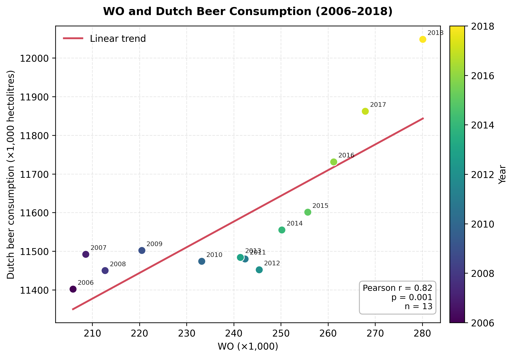

#1. Fantastic yeasts and where to find them: the hidden diversity of dimorphic fungal pathogens - MCC Van Dyke et al., 2019
#2. The Rise of Coccidioides: Forces Against the Dust Devil Unleashed - MCC Van Dyke et al.,2019 
#3. An analysis of the forces required to drag sheep over various surfaces - JT Harvey, Applied Ergonomics, 2002
#4. The neurocognitive effects of alcohol on adolescents and college students - DW Ziegler et al., 2005
#5. Kinematic and chemical evolution of early-type galaxies - DW Ziegler et al., 2005

Figure 1. Scatter plot of the 13 annual observations from 2006–2018 (300 DPI).

This plot shows a strong positive linear association between WO and Dutch beer consumption: Pearson's correlation is r = 0.818 across n = 13 observations, with p = 0.0006.
Furthermore, higher WO values generally coincide with higher beer-consumption values. The fitted line estimates an increase of about 6.65 thousand hectolitres in beer consumption for each additional thousand units of WO.
The observations are ordered in time, and both variables tend to increase over the years. All in all, of course this correlation alone doesn't prove causation and doesn't necessarily establish that changes in WO cause changes in beer consumption; a shared time trend or other external (or not) factors could explain the pattern.
